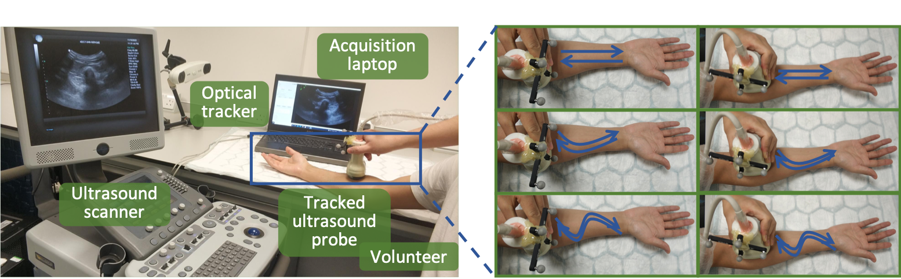

# Trackerless 3D Freehand Ultrasound Reconstruction Challenge
<!-- ## About -->
**Welcome to the Trackerless 3D Freehand Ultrasound Reconstruction Challenge 2024 (TUS-REC2024)！**   

The TUS-REC2024 Challenge is a part of the [27th International Conference on Medical Image Computing and Computer Assisted Intervention (MICCAI 2024)](https://conferences.miccai.org/2024/en/default.asp), held in conjunction with the [5th ASMUS workshop](https://miccai-ultrasound.github.io/#/asmus24), from October 6th to 10th 2024 in Marrakesh, Morocco.

[Website](https://github-pages.ucl.ac.uk/tus-rec-challenge/) |
[Train Dataset (Part 1,](https://zenodo.org/doi/10.5281/zenodo.11178508) 
[Part 2,](https://zenodo.org/doi/10.5281/zenodo.11180794)
[Part 3)](https://zenodo.org/doi/10.5281/zenodo.11355499) |
[Code Usage Instruction](#code) |
[Data Usage Policy](#data-usage-policy)

## Background
Reconstructing 2D Ultrasound (US) images into a 3D volume enables 3D representations of anatomy to be generated which are beneficial to a wide range of downstream tasks such as quantitative biometric measurement, multimodal registration, 3D visualisation and interventional guidance. Although substantive progress has been made recently through non-deep-learning- and deep-learning-based approaches, this application is still challenging due to 1) inherent accumulated error - frame-to-frame transformation error will be accumulated through time when reconstructing long sequence of US frames, and 2) a lack of publicly-accessible data with synchronised spatial location, often obtained from tracking devices, for benchmarking the performance and for training learning-based methods. The TUS-REC challenge aims to provide a benchmark for freehand US reconstruction with publicly available in vivo US data from forearms of one hundred volunteers, using multiple predefined scanning protocols, targeted at improving the reconstruction performance in this challenging task. The outcome of the challenge includes 1) open-sourcing the first largest tracked US datasets with accurate positional information; 2) establishing one of the first benchmarks for 3D US reconstruction, suitable for modern learning-based data-driven approaches.

## Task Description
The aim of this task is to reconstruct 2D US images into a 3D volume. The algorithm is expected to take the entire scan as input and output two different sets of transformation-representing displacement vectors as results, a set of displacement vectors on individual pixels and a set of displacement vectors on provided landmarks. There is no requirement on how the algorithm is designed internally, for example, whether it is learning-based method; frame-, sequence- or scan-based processing; or, rigid-, affine- or nonrigid transformation assumptions. 

Participant teams are expected to make use of the sequential data and potentially make knowledge transfer from other domains such as computer vision and computer-assisted intervention. The participant teams are expected to take US scan as input and output two sets of pixel displacement vectors, indicating the transformation to reference frame, i.e., first frame in this task. The evaluation process will take the generated displacement vectors from their dockerized models, and produce the final accuracy score to represent the reconstruction performance, at local and global levels, representing different clinical application of the reconstruction methods.

For details information, please see [Assessment Criteria](https://github-pages.ucl.ac.uk/tus-rec-challenge/assessment.html), and also [generate_DDF.py](https://github.com/QiLi111/tus-rec-challenge_baseline/blob/96e62989b5b5b04296294cb8d5dff1ca6878266c/generate_DDF.py) for an example of generating required 4 kinds of displacement vectors.

## Dataset

Acquisition devices and config: The 2D US images were acquired using an Ultrasonix machine (BK, Europe) with a curvilinear probe (4DC7-3/40). The associated position information of each frame was recorded by an optical tracker (NDI Polaris Vicra, Northern Digital Inc., Canada). The acquired US frames were recorded at 20 fps, with an image size of 480×640, without speckle reduction. The frequency was set at 6MHz with a dynamic range of 83 dB, an overall gain of 48% and a depth of 9 cm. 

Scanning protocol: Both left and right forearms of volunteers were scanned. For each forearm, the US probe moves in three different trajectories (straight line shape, "C" shape, and "S" shape), in a distal-to-proximal direction followed by a proximal-to-distal direction, with the US plane perpendicular of and parallel to the scanning direction. The train dataset contains 1200 scans in total, 24 scans associated with each subject.



### Dataset structure: 

* The training data contains 50 folders (one subject per folder), each with 24 scans. Each .h5 file corresponds to one scan, storing image and transformation of each frame within this scan. Key-value pairs in each .h5 file are explained below.

    * `frames`  - All frames in the scan; with a shape of [N,H,W], where N refers to the number of frames in the scan, H and W denote the height and width of a frame. 

    * `tforms` - All transformations in the scan; with a shape of [N,4,4], where N is the number of frames in the scan, and the transformation matrix denotes the transformation from tracker tool space to camera space. 

    * Notations in the name of each .h5 file: “RH”: right arm; “LH”: “left arm”; “Per”: perpendicular; “Par”: parallel; “L”: straight line shape; “C”: C shape; “S”: S shape; “DtP”: distal-to-proximal direction; “PtD”: proximal-to-distal direction; For example, “RH_Ver_L_DtP.h5” denotes a scan on the right forearm, with ultrasound probe perpendicular of the forearm sweeping along straight line, in distal-to-proximal direction.

* Calibration matrix: The calibration matrix was obtained using a pinhead-based method. The `scaling_from_pixel_to_mm` and `spatial_calibration_from_image_coordinate_system_to_tracking_tool_coordinate_system` are provided in the “calib_matrix.csv”, where `scaling_from_pixel_to_mm` is the scale between image coordinate system (in pixel) and image coordinate system (in mm), and `spatial_calibration_from_image_coordinate_system_to_tracking_tool_coordinate_system` is the rigid transformation between image coordinate system (in mm) to tracking tool coordinate system.

## Code

### Instruction
This repository provides a framework for freehand US pose regression, including usage of various types of predictions and labels (see [transformation.py](https://github.com/QiLi111/tus-rec-challenge_baseline/blob/main/utils/transform.py)). Please note that the networks used here are small and simplified for demonstration purposes.

For instance, the network can predict the transformation between two US frames as 6 DOF "parameter", and if the label type is "point", the loss is calculated as the point distance (by transforming "parameter" to "point" using function [parameter_to_point](https://github.com/QiLi111/tus-rec-challenge_baseline/blob/96e62989b5b5b04296294cb8d5dff1ca6878266c/utils/transform.py#L267)). The steps below illustrate an example of training a pose regression model and generate 4 kinds of displacements. 

<!-- We use the transformation from image coordinate system (in mm) to image coordinate system (in mm), for example described in function [to_transform_t2t](https://github.com/QiLi111/tus-rec-challenge_baseline/blob/2cdc92c003af8d985a50f27ea97900ba35da5c98/utils/transform.py#L93).  -->

<!-- The model trained with labels defined above is independent of the rigid part in calibration matrix, and only dependent of the scaling. That is to say, the trained model is independent of the relative position between the tracker tool and the probe, and only dependent of the configuration of the probe.  -->

For more information about the algorithm, refer to [Prevost et al. 2018](https://doi.org/10.1016/j.media.2018.06.003) and [Li et al. 2023](https://doi.org/10.1109/TBME.2023.3325551).

### Steps to run the code
#### 1. Clone the repository.
```
git clone https://github.com/QiLi111/tus-rec-challenge_baseline.git
```

#### 2. Navigate to the root directory.
```
cd tus-rec-challenge_baseline
```

#### 3. Install conda environment

``` bash
conda create -n freehand-US python=3.9.13
conda activate freehand-US
pip install -r requirements.txt
conda install pytorch3d --no-deps -c pytorch3d
```

#### 4. Create directories.
```
mkdir data
cd data
mkdir frames_transfs
mkdir landmarks
```

#### 5. Download data from [Train Dataset (Part 1,](https://zenodo.org/doi/10.5281/zenodo.11178508) [Part 2,](https://zenodo.org/doi/10.5281/zenodo.11180794) [Part 3)](https://zenodo.org/doi/10.5281/zenodo.11355499).
   Put `train_part1.zip`, `train_part2.zip`, `landmark.zip`, and `calib_matrix.csv` into `./data` directory.

#### 6. Unzip.
Unzip `train_part1.zip` and `train_part2.zip` into `./data/frames_transfs` directory, and unzip `landmark.zip` into `./data/landmarks` directory.

```
unzip \train_part\*.zip -d frames_transfs
unzip \landmark.zip -d landmarks
```

#### 7. Make sure the folder structure is the same as follows.
```bash
├── data/ # Contains data set 
│ ├── frames_transfs/ # Unzipped from `train_part1.zip` and `train_part2.zip`, including 50 folders
│  ├── 000/ # Contains 24 scans in subject 000
│    ├── RH_Per_L_DtP.h5 # Scan info including frames and transformations 
│    ├── ...
│  ├── ...
│  ├── 049/ # Contains 24 scans in subject 049
│ ├── landmarks/ # Unzipped from `landmark.zip`
│  ├── landmark_000.h5 # Landmark coordinates in subject 000
│  ├── ...
│  ├── landmark_049.h5 # Landmark coordinates in subject 049
├── train.py # Training script 
├── generate_DDF.py # Generate 4 kinds of DDF 
├── plot.py # An example of load data and plot scan
├── utils/ # Utility functions 
│ ├── transform.py # Transformation functions
│ ├── loader.py # Data loader
│ ├── loss.py # Loss function and metrics
│ ├── network.py # Networks
│ ├── funs.py # Functions used during training
│ ├── plot_functions.py # Functions used during plotting
│ ├── rigid_transform_3D.py # Adapted transformation function
│ ├── evaluation.py # Functions used during DDF generation
├── options/ # Model hyperparameter 
│ ├── base_options.py # Hyperparameters for dataroot and GPU
│ └── train_options.py # Hyperparameters for training and generating DDF
├── requirements.txt # packages for environment installation
```

#### 8. Train model.
``` bash
python3 train.py
```
#### 9. Generate DDF.
``` bash
python3 generate_DDF.py
```

## Data Usage Policy
The training and validation data provided may be utilized within the research scope of this challenge and in subsequent research-related publications. However, commercial use of the training and validation data is prohibited. In cases where the intended use is ambiguous, participants accessing the data are requested to abstain from further distribution or use outside the scope of this challenge. Please refer to [this Section](https://github-pages.ucl.ac.uk/tus-rec-challenge/policies.html) for detailed data usage policy.

After we publish the summary paper of the challenge, if you use our dataset in your publication, please cite the summary paper (reference will be provided once published) and the follwing article: 
* Qi Li, Ziyi Shen, Qian Li, Dean C. Barratt, Thomas Dowrick, Matthew J. Clarkson, Tom Vercauteren, and Yipeng Hu. "Long-term Dependency for 3D Reconstruction of Freehand Ultrasound Without External Tracker." IEEE Transactions on Biomedical Engineering, vol. 71, no. 3, pp. 1033-1042, 2024. doi: [10.1109/TBME.2023.3325551](https://ieeexplore.ieee.org/abstract/document/10288201).